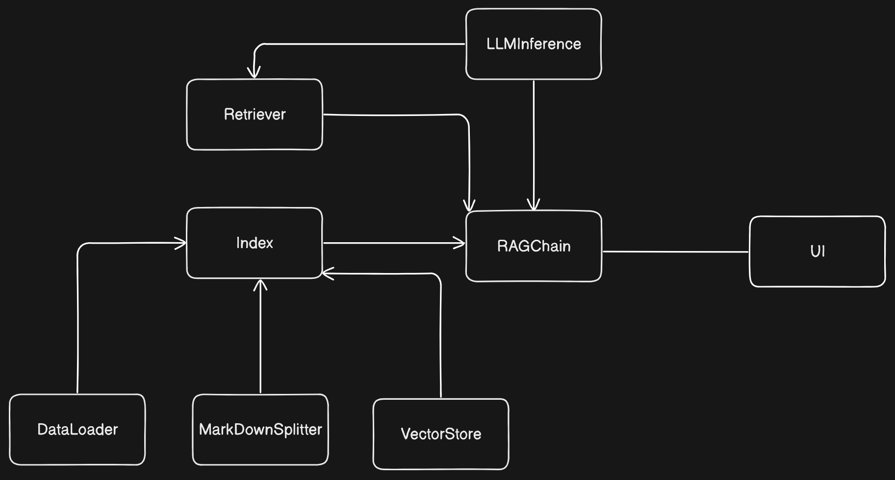

# RAG-Based Knowledge Extraction Challenge

## Overview

This project implements a Retrieval-Augmented Generation (RAG) system designed to tackle the challenge of extracting and utilizing knowledge from markdown files. The core of the solution integrates document retrieval and generation using a retrieval ensemble of BM25 lexical search and MultiQuery semantic search based on a Pinecone vector database, powered by Hugging Face embeddings.

### Solution Architecture

The solution is structured around the following core components:


1. **Document Loader**:
   - **DataLoader**: Responsible for loading markdown files from the specified directory. This component ensures that all relevant documents are processed and ready for indexing and retrieval.

2. **Document Splitter**:
   - **MarkDownSplitter**: This component splits the markdown documents into manageable chunks using a combination of hierarchical header-based splitting and recursive character-based splitting. This allows for efficient indexing and retrieval.

3. **Indexing**:
   - **VectorStore**: This component manages the creation and maintenance of a Pinecone vector store. It uses Hugging Face embeddings to convert document chunks into vectors, which are then stored in Pinecone for semantic search.
   - **Langchain Index**: This enables the incremental addition of external knowledge (data) to the index. Works as a wrapper around the pinecone vector store. It keeps a sql based record of all embedded chunks. 

4. **Retriever**
   - **BM25Retriever**: An additional retriever that leverages the BM25 algorithm to perform lexical search on the raw text chunks before embedding and storage in Pinecone.
   - **MultiQueryRetriever**: This retriever enhances the semantic search process by generating multiple similar questions based on the user's input query. By doing so, it mitigates issues related to short or ambiguous queries. The generated questions are then used to retrieve more relevant documents from the vector store.

5. **RAG Chain**:
   - **RAGChain**: This orchestrates the end-to-end process, including retrieval of relevant document chunks using BM25, the multi-query enhanced semantic retriever, and vector search. It then generates an answer using a language model (LLM) based on the retrieved context.

6. **User Interface**:
   - **Streamlit-based UI**: Provides a user-friendly interface for querying the system, updating the index, and displaying results. The UI allows users to input questions and view the generated responses in real-time.

### Installation and Usage Instructions

#### Installation

1. **Clone the Repository**:
   ```bash
   git clone https://github.com/NiklasTUM/RAG-based_Knowledge_Extraction_Challenge.git
   cd RAG-based_Knowledge_Extraction_Challenge

2. **Set Up a Virtual Environment**:
   ````bash
   python -m venv .venv
   source .venv/bin/activate  # On Windows: .\.venv\Scripts\Activate.ps1

3. **Install Dependencies:**
   ```bash
   pip install -r requirements.txt

4. **Set Up Environment Variables:**

   Create a .env file in the root directory with the necessary API keys and configuration. 
   
   - Please create a finegrained huggingface api key [here](https://huggingface.co/settings/tokens/new?) . 
   **Set "Make calls to the serverless Inference API"  to true**
   
   - To create a pinecone api key, please create first a pinecone account [here](https://huggingface.co/settings/tokens/new?)
   (you can use your GitHub account). Then, on the left click on API keys and copy the default api key.
   ````makefile
   HUGGINGFACE_API_KEY=your_huggingface_api_key #  https://huggingface.co/settings/tokens/new?
   PINECONE_API_KEY=your_pinecone_api_key # https://www.pinecone.io/ 
   MISTRAL_7B_INSTRUCT_API_URL=mistralai/Mistral-7B-Instruct-v0.3
   EMBEDDING_MODEL=sentence-transformers/all-mpnet-base-v2

5. **Run the Application:**
   ```bash
   python -m streamlit run ./src/ui/UserInterface.py

### Usage
- **Initialization & Indexing**: Upon start-up, please press the "Update Index" button. This will start the loading of data, chunking of the markdown files, embedding of chunks and storage in the pinecone database. This may take a while for the first time.
- **Querying**: Enter your question in the input field and hit "Get Answer". The system will retrieve relevant context and generate a concise answer.
- **Updating the Index**: Click on "Update Index" to reload and re-index the documents.

### Explanation of RAG Implementation

The Retrieval-Augmented Generation (RAG) model in this project leverages both lexical and semantic retrieval methods to extract relevant information from a large corpus of markdown files:

- **BM25Retriever**: Handles exact keyword matching, ensuring that specific terms in the query are directly matched with documents.
- **MultiQueryRetriever**: Enhances the semantic retrieval by generating three variations of the user's query using the same LLM used for answer generation. This process improves the quality of retrieval by addressing issues like short or ambiguous queries.
- **Pinecone Vector Store**: Facilitates semantic search, retrieving documents based on the contextual similarity of the query to document embeddings.
- **Langchain Index**: Enables the incremental addition of external knowledge (data) to the index. Works as a wrapper around the pinecone vector store. It keeps a sql based record of all embedded chunks. 

These retrieval methods are combined in an ensemble retriever, and the results are passed to an LLM hosted via a Hugging Face API, which generates a final answer based on the retrieved context. This approach ensures that the system not only retrieves documents that are relevant by keyword but also understands the context of the query, leading to more accurate and relevant answers.

### Assumptions

- **Document Structure**: The Markdown documents follow a standard structure with headers (`#`, `##`, etc.), making hierarchical splitting effective.
- **Data Volume**: The volume of data is manageable within the limits of the Pinecone service and Hugging Face API, without requiring advanced scaling techniques.
- **User Queries**: The user queries are assumed to be in English and within the general domain of the provided Markdown documents.

### Future Improvements
1. **Advanced Indexing Techniques**:
   - Incorporate additional indexing techniques, such as TF-IDF, or explore other vector search libraries like FAISS for high-performance retrieval.

2. **Scalability Enhancements**:
   - Implement sharding or multi-node indexing in Pinecone to handle larger datasets.
   - Introduce caching mechanisms to speed up repeated queries.

3. **Multi-language Support**:
   - Extend the system to handle queries and documents in multiple languages using multi-lingual embeddings.

4. **Interactive Learning**:
   - Enable the system to learn from user interactions, improving retrieval and generation quality over time.

5. **Enhanced UI Features**:
   - Add visualization tools to display the retrieval process and context selection, providing users with more transparency and control over the system.

### Unique Features

- **Hybrid Retrieval Mechanism**: Combines BM25, MultiQueryRetriever, and vector-based retrieval, offering a unique balance between precise keyword matching and contextual understanding.
- **Streamlit Interface**: Provides an easy-to-use, interactive UI for querying and managing the system.
- **Robust Logging**: The system includes comprehensive logging for all processes, ensuring easy debugging and monitoring.


